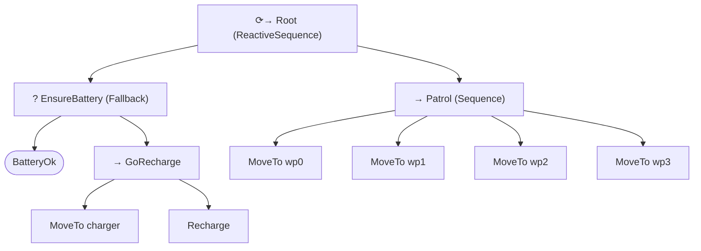

# 🌱 sapling

**A behavior tree engine written from scratch in modern C++17, integrated with ROS 2.**


sapling implements the core of a behavior tree (BT) runtime (tick semantics, halting, a typed
blackboard, and the standard control-flow and decorator nodes) without depending on
BehaviorTree.CPP or py_trees. A ROS 2 package then uses it to drive a battery-aware patrol robot in
turtlesim that interrupts its patrol to recharge when the battery runs low.

The goal of the project was to understand behavior trees by building one: the same model used by
Nav2 and MoveIt 2 for robot decision-making.

> **Status:** 🚧 work in progress. See the [roadmap](docs/ROADMAP.md).
>
> | Milestone | | Status |
> |---|---|---|
> | M1 | Node, blackboard, leaves | ⬜ |
> | M2 | Sequence & Fallback | ⬜ |
> | M3 | Decorators | ⬜ |
> | M4 | Reactive nodes & Parallel | ⬜ |
> | M5 | Tree runner & example | ⬜ |
> | M6 | ROS 2 turtlesim patrol | ⬜ |
> | M7 | Stretch goals | ⬜ |

## Features

- **Tick-based execution** with `Running` / `Success` / `Failure` semantics and clean
  **halting** of interrupted subtrees
- **Control nodes:** `Sequence`, `Fallback`, `ReactiveSequence`, `ReactiveFallback`, `Parallel`
- **Decorators:** `Inverter`, `ForceSuccess`, `Retry`, `Repeat`
- **Type-safe blackboard** built on `std::any` / `std::optional`
- **54 unit tests** (GoogleTest) run in CI with AddressSanitizer + UBSan
- **Installable CMake package** (`find_package(sapling_core)`), buildable standalone or with colcon
- **ROS 2 Jazzy integration** where the behaviours are ROS-free and unit-testable, and a thin node
  maps topics onto the blackboard

## The patrol robot



Because the root is *reactive*, `BatteryOk` is re-checked on every tick. When it fails, the running
`MoveTo` is halted (the turtle stops), the robot drives to the charger, recharges, then resumes
patrolling.

<!-- TODO: add a GIF of the turtle here once M6 works. Peek (Linux) or `ffmpeg` screen capture. -->

## Repository layout

```
sapling/
├── sapling_core/            # The BT engine (plain CMake, no ROS)
│   ├── include/sapling/     #   public headers: node, blackboard, composite, decorators, tree
│   ├── src/                 #   implementation
│   ├── tests/               #   GoogleTest suites, one per milestone
│   └── examples/            #   enter_room.cpp - the classic "open the door" tree
├── sapling_turtle/          # ROS 2 package: patrol behaviour for turtlesim
│   ├── include/ src/        #   ROS-free leaves (MoveTo, Recharge) + the ROS node
│   ├── config/patrol.yaml   #   waypoints, charger, battery parameters
│   └── launch/
├── docs/                    # Roadmap, design notes
└── .github/workflows/ci.yml
```

## Building

### Core library and tests (any Linux/macOS with CMake ≥ 3.16 and a C++17 compiler)

```bash
cmake -S sapling_core -B build -DCMAKE_BUILD_TYPE=Debug
cmake --build build -j
ctest --test-dir build --output-on-failure
./build/enter_room_example
```

Run a single milestone's tests: `./build/sapling_tests --gtest_filter='M2*'`

### ROS 2 (Jazzy)

```bash
mkdir -p ~/sapling_ws/src && cd ~/sapling_ws/src
git clone https://github.com/YOUR_USERNAME/sapling.git
cd ~/sapling_ws
rosdep install --from-paths src --ignore-src -y
colcon build --cmake-args -DSAPLING_BUILD_TESTS=OFF
source install/setup.bash
ros2 launch sapling_turtle patrol.launch.py
```

## Design notes

See [docs/DESIGN.md](docs/DESIGN.md) for the reasoning behind the main decisions: memory vs.
reactive control nodes, the template-method `tick()`/`onTick()` split, why halting only calls
`onHalt()` on running nodes, and how sapling compares with BehaviorTree.CPP.

## References

- Colledanchise & Ögren, *Behavior Trees in Robotics and AI: An Introduction* (CRC Press, 2018)
- [BehaviorTree.CPP documentation](https://www.behaviortree.dev/)
- [py_trees documentation](https://py-trees.readthedocs.io/)

## License

MIT
